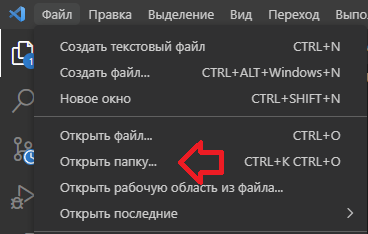
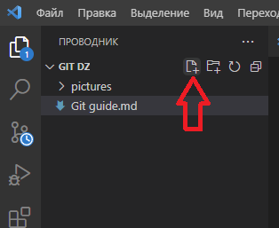

# Инструкция по работе с Git
Чтобы начать работу с Git, для начала нам нужно выбрать папку в интерфейсе программы Visual Studio code.

Для это, пожалуйста, нажмите на опцию **Файл** и воспользуйтесь опцией открыть папку.

*Открыть папку можно и с помощью команды ctrl + k o*

После того, как мы открыли папку, нужно создать файл. Файл можно создать с любым расширением, но для сегодняшней инструкции мы будем использовать разрешение .md

Для работы с Git, нам нужно открыть терминал, для этого выбираем опцию **Терминал** и нажимаем кнопку **Создать терминал**

## Для начала работы с Git нужно сделать следующее 
1. Нужно ввести команду git init
2. Нам нужно представиться программе, для этого используем следующие комманды

git config --global user.email "you@example.com"  

git config --global user.name "Your Name"

3. Добавить файл в репозиторий - git add "file_name"
4. И нажать ctrl + s, либо воспользоваться опцией **Файл** и нажать кнопку **сохранить**

После этого можно воспользоваться командой Git status. Если Вы все сделали верно, то Вы программа выведет следующий текст. 

Т.к. у нас блок называется ***Контроль Версий***, то мы рассмотрим еще одну полезную функцию для работы с Git.

Что такое контроль версий? Ну это можно узнать на семинаре. 

#### Почему Git и ему подобные программы хороши для работы с контролем версий? Git хранит сумму разности от файла прошлой версии. Пример:
1. Вы пишите код для игры. Пускай Вам нужно прописать логику поведение отдельного НПС
2. Каждое его действие Вы отдельно сохраняете.
3. Случилось такое, что в поведении Вашего НПС произошла ошибка. Не будет вдаваться в подробности, нам нужно ее починить. 
#### Тут нам на помощь приходит Git. С его помощью мы можем откатиться на более раннюю версию кода и посмотреть,в какой из версий произошла данная ошибка.

Чтобы сохранить любые внесенные изменения, нужно воспользоваться командой Git commit -m "Что меняли/что добавили и тд"

Теперь у нас есть своеобразное сохранение. Точка возврата. 

#### Введя команду Git Log ,мы увидим точку сохранения наших изменений.

Для того, чтобы откатить изменения к прошлой версии, можно воспользоваться командой git checkout "Первые 4 символа нашей точки сохранения после commit" 